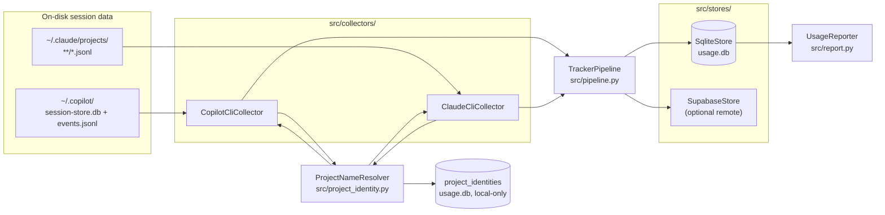
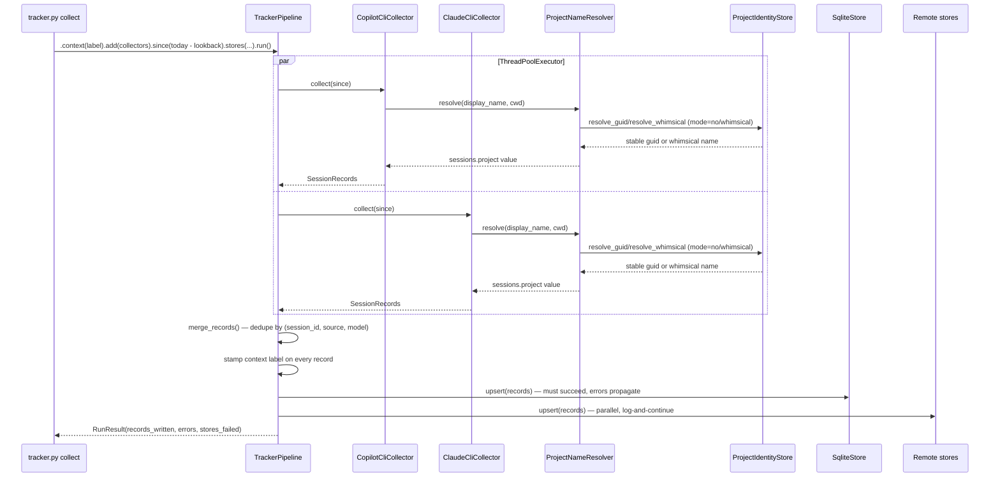
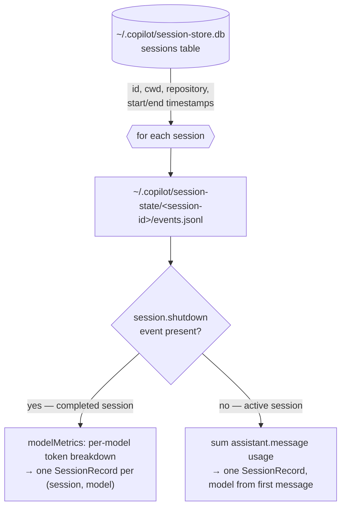

# TokenTracer Architecture

This document describes how TokenTracer works end to end: how token usage is
collected, where the data comes from, how it is stored, reported, and synced.
The audience is contributors — file paths, protocols, and extension points are
included throughout.

## Overview

TokenTracer is a local-first pipeline. **Collectors** read session artifacts
that AI CLIs already write to disk, normalize them into `SessionRecord`s, and
a **pipeline** deduplicates and writes them to **stores** (always a local
SQLite database, optionally remote sinks such as Supabase). The **reporter**
aggregates the local database for display. The design is Open/Closed: adding a
new data source or a new sink requires implementing one protocol and
registering it — no other module changes.



| Module | Responsibility |
| --- | --- |
| `tracker.py` | CLI entry point: builds argparse from the command registry and dispatches |
| `src/commands/` | `Command` protocol + static `COMMANDS` registry; one module per subcommand (`collect`, `report`, `config`, `projects`, `sync`) |
| `src/models.py` | `SessionRecord` frozen dataclass; `merge_records` dedupe |
| `src/collectors/` | Read-only source adapters (`ActivityCollector` protocol) |
| `src/pipeline.py` | Fluent `TrackerPipeline`; parallel collection, fan-out to stores |
| `src/project_identity.py` | `ProjectNameResolver` tri-state naming policy + `ProjectIdentityStore` |
| `src/stores/` | `SessionStore` protocol, SQLite + Supabase implementations, registry |
| `src/report.py` | `UsageReporter`: aggregation and table rendering |
| `src/config.py` | Paths, `~/.tokentracer.toml` loading, `${VAR}` expansion |
| `src/whimsy/` | Standalone stdlib-only `generate_name()` package for masked project names |

## Collect flow

`tracker.py collect` builds the pipeline in `_build_pipeline()` (in `src/commands/collect.py`) and runs it:



Key invariants:

- **Idempotent** — re-running `collect` overwrites existing rows. The merge
  key is `(session_id, source, model)`; upsert is last-write-wins
  (`INSERT OR REPLACE`). There is no summation across runs.
- **Read-only sources** — collectors never write to the files they read.
- **Fault isolation** — a collector exception is caught and reported as a
  warning; other collectors still run. The local SQLite write must succeed;
  remote store failures are logged without blocking.
- The lookback window defaults to 3 days (`--lookback N` to backfill).

`ProjectNameResolver` applies the shared tri-state naming policy before a
record reaches the pipeline. Collectors pass source-specific `(display_name,
cwd)` pairs into `resolve()`: `"yes"` returns the real display name, `"no"`
stores a stable 12-hex guid derived from `cwd`, and `"whimsical"` stores a
stable docker-style masked name tied to that same guid.

### The record model

`SessionRecord` (`src/models.py`) is a frozen dataclass — one row per
`(session_id, source, model)`. Fields: `date`, `start_ts`, `end_ts`,
`project`, `turns`, `tool_calls`, `input_tokens`, `output_tokens`,
`cache_creation_tokens`, `cache_read_tokens`, `context_peak_tokens`,
`reasoning_tokens`, and `context` (the usage-context label, e.g.
`"work"`/`"personal"`).

## Data sources

Collectors implement the `ActivityCollector` protocol
(`src/collectors/base.py`): a `source: str` class attribute plus
`collect(since: date) -> Iterable[SessionRecord]`.

### Copilot CLI (`src/collectors/copilot_cli.py`, source = `copilot_cli`)

Reads **two** artifact kinds under `~/.copilot/`:



**1. `session-store.db`** — a SQLite database with a `sessions` table
providing session id, `cwd`, `repository`, and start/end timestamps. Two
schema generations are supported (detected via `PRAGMA table_info`):

| Schema | Start column | End column |
| --- | --- | --- |
| Old CLI | `startedAt` | `endedAt` |
| New CLI (≥ mid-2026) | `created_at` | `updated_at` |

Sessions starting before `since` are skipped. The collector passes
`(repo_name or cwd_basename, row["cwd"])` into the shared resolver:
`--project-mode yes` stores the real project name, `no` stores the stable guid
for that cwd, and `whimsical` stores the stable masked name for that cwd.

**2. `session-state/<session-id>/events.jsonl`** — the per-session event log.
Newer CLI versions nest each event's payload under a `data` key; the collector
reads `event.get("data") or event` to handle both. Two parse paths:

- **Completed sessions** write a `session.shutdown` event containing
  `modelMetrics` — a per-model breakdown. Each model becomes its own
  `SessionRecord`. Field layout differs by CLI generation:

  | Field | Old format | New format |
  | --- | --- | --- |
  | Token counts | flat on the metric dict | nested under `usage` |
  | Turns | `turns` | `requests.count` |

  Token keys (both formats): `inputTokens`, `outputTokens`,
  `cacheReadTokens`, `cacheWriteTokens`, `reasoningTokens`.

- **Active sessions** (no shutdown event yet) fall back to summing
  `assistant.message` events. The new format exposes only output tokens
  there — full input/cache counts arrive at shutdown, and the next
  `collect` run overwrites the row with the final numbers.

- **Tool calls** — `tool.execution_complete` events are counted as they
  are encountered. When a shutdown event is present the counts are
  attributed per model via each event's `model` field; without a shutdown
  event the total is attributed to the single detected model. The event
  scan no longer stops early at `session.shutdown` so tool events that
  follow the shutdown marker are captured.

- **Context peak** — before event parsing begins, the collector runs one
  bulk query against `assistant_usage_events` in `session-store.db`:

  ```sql
  SELECT session_id, model, MAX(input_tokens + output_tokens) AS peak
  FROM assistant_usage_events
  WHERE agent_id IS NULL
  GROUP BY session_id, model
  ```

  `agent_id IS NULL` excludes subagent requests. `input_tokens` in this
  table is cache-inclusive, so `input_tokens + output_tokens` is the full
  per-request footprint. Results are loaded into a
  `dict[(session_id, model)] -> peak` and attached to each record as
  `context_peak_tokens`. If the table does not exist (`OperationalError`),
  the dict is empty and all peaks default to `0` — no warning is emitted.

  The `assistant_usage_events` table schema:

  | Column | Meaning |
  | --- | --- |
  | `session_id` | session the request belongs to |
  | `turn_index` | conversation turn |
  | `agent_id` | `NULL` for main conversation; set for subagents |
  | `model` | model id for the request |
  | `input_tokens` | total prompt tokens (cache-inclusive) |
  | `output_tokens` | response tokens |
  | `cache_read_tokens`, `cache_write_tokens`, `reasoning_tokens` | breakdown fields |

### Claude CLI (`src/collectors/claude_cli.py`, source = `claude_cli`)

Each Claude Code conversation is one JSONL file:

```
~/.claude/projects/<project-id>/<conversation-id>.jsonl
```

- The **file stem is the `session_id`**; one `SessionRecord` per file.
- Files whose **mtime** predates the lookback window are skipped without
  being opened (cheap pre-filter); the session start date is then checked
  against `since` after parsing.
- Only entries with `type: "assistant"` carry usage. Each one counts as a
  turn and contributes `message.usage` fields:

  | JSONL key | SessionRecord field |
  | --- | --- |
  | `input_tokens` | `input_tokens` |
  | `output_tokens` | `output_tokens` |
  | `cache_creation_input_tokens` | `cache_creation_tokens` |
  | `cache_read_input_tokens` | `cache_read_tokens` |

- **Tool calls** — `tool_use` content blocks within each assistant
  message's `content` list are counted into `tool_calls`. Messages with
  string content are skipped safely.

- **Context peak** — for each assistant message the collector computes the
  per-message token footprint:

  ```
  input_tokens + cache_read_input_tokens + cache_creation_input_tokens + output_tokens
  ```

  The maximum across all messages becomes `context_peak_tokens` on the
  record. `input_tokens` here **excludes** cache, so all cache components
  are added explicitly. `reasoning_tokens` stays `0` — the Claude CLI JSONL
  has no source field for it.

- Session `start_ts`/`end_ts` are the min/max `timestamp` across all
  entries; the model comes from the first assistant `message.model`.
  The collector passes `(cwd_basename, first_cwd_seen)` into the shared
  resolver, so `sessions.project` holds either the real directory name,
  the stable guid, or the stable whimsical mask for that cwd.

### Why no VS Code / Web / Desktop collectors

Those surfaces render token data live in the UI but never persist it to
disk — there is nothing to collect. Do not add a collector for a surface
unless it starts persisting token data.

### `context_peak_tokens` semantics

`context_peak_tokens` represents the largest total token footprint of any
single API request within a session:

```
peak = MAX over requests of (prompt tokens + output tokens)
     where prompt tokens = input + cache read + cache write
```

Key properties:
- Values are **exact API-reported figures** — no estimation.
- Computed per `(session_id, source, model)`, matching the merge key.
- **Subagent requests are excluded** (Copilot: `agent_id IS NULL` filter;
  Claude: no subagent rows exist in the JSONL files). The peak reflects the
  main conversation context window only. Consequently, a model whose usage
  in a session came entirely from subagent requests gets
  `context_peak_tokens = 0` even though its token counts are non-zero.
- Defaults to `0` when unavailable (older Copilot installs without the
  `assistant_usage_events` table, sessions with no assistant activity). No
  fallback estimation is performed.
- Re-running `collect --lookback N` backfills peaks for sessions whose
  source files still exist.

## Storage

`SqliteStore` (`src/stores/sqlite.py`) owns the local database
(`~/.tokentracer/usage.db` when installed; `usage.db` next to `tracker.py`
in a repo checkout; override with `--db`).

- **`sessions` table** — mirrors `SessionRecord`, with
  `PRIMARY KEY (session_id, source, model)` and `INSERT OR REPLACE` upserts.
- **`project_identities` table** — also lives in `usage.db`, keyed by a
  normalized (case-insensitive, trimmed) `cwd_key`, with stable `guid` and
  optional `whimsical_name` columns. It is local-only: `sync_log`,
  `unsynced_for()`, and remote-store upserts never reference it. Inspect it
  with `python3 tracker.py projects`.
- **`sync_log` table** — `PRIMARY KEY (session_id, source, model,
  store_name)`; tracks which rows have been pushed to which remote store,
  so `sync` is incremental and idempotent per store.
- **Migration** — on first connect, a legacy `usage` / `daily_activity`
  table from older versions is dropped with a warning asking the user to
  re-collect (`collect --lookback 90`).

The whimsical-name implementation lives in `src/whimsy/`, a self-contained
stdlib-only package with one public function, `generate_name(existing=None,
rng=None)`. `src/project_identity.py` is its only in-tree consumer, which
keeps the package extractable into its own repository later.

## Report flow

`UsageReporter` (`src/report.py`) reads only the local SQLite database.

- `--period` scopes every view: `day` (default, today) | `month` | `year` |
  `all` (no date filter).
- **Default view** — one row per session: Project, Source, Model, Start,
  End, Input, Output, Reasoning, CacheRead, CacheCreate, CacheHit%,
  CtxPeak, Turns, Tools.
- **`--summary`** — compact per-session view; combined with a period it
  becomes an aggregated roll-up grouped by period + model.
- **`--by-project`** — groups by project (requires a non-null
  `sessions.project`; default `--project-mode no` produces stable per-project
  GUIDs even when real names are masked).
- **`--detailed`** — dumps every row in the database regardless of date,
  with all 17 columns: Session, Source, Model, Date, Start, End, Project,
  Turns, Tools, Input, Output, CacheCreate, CacheRead, CtxPeak, Reasoning,
  Context, and **Synced** (comma-separated store names from `sync_log`,
  empty if never synced). Overrides `--summary` and `--by-project`; ignores
  `--period`; `--model` filter still applies; works with `--json`.
- **Cache hit %** = cache reads as a share of total input-side tokens; a
  header line reports overall cache efficiency (cache reads cost ~10% of
  regular input tokens).
- `--model <name>` filters, `--json` emits machine-readable output.

## Configuration

`Config.load()` (`src/config.py`) reads `~/.tokentracer.toml`
(`C:\Users\<you>\.tokentracer.toml` on Windows):

- `[tracking] track_project_names` (string, default `"no"`) — one of
  `"yes"` (real name), `"no"` (stable 12-hex guid per cwd), or
  `"whimsical"` (stable docker-style masked name). `tracker.py config set`
  validates the enum; invalid or legacy boolean TOML values warn and fall
  back to `"no"`. `collect --project-mode <yes|no|whimsical>` overrides it
  per run.
- `[tracking] context` (string, default `"personal"`) — usage-context label
  stamped on every collected record via `TrackerPipeline.context()`;
  `--context <label>` overrides per run.
- `[stores.<name>]` sections declare remote stores (see below).

`${VAR}` placeholders in string values are expanded at store instantiation:
lookup order is `os.environ` first, then `~/.tokentracer.env` (simple
`KEY=VALUE` file; `#` comments and optional quotes supported). A missing
variable raises `ValueError`, so secrets never need to live in the TOML file.

`tracker.py config set <key> <value>` rewrites the TOML safely, preserving
other keys.

## Sync and the stores registry

Stores implement the `SessionStore` protocol (`src/stores/__init__.py`):
a `name: str` class attribute, `upsert(records) -> int`, and `close()`.

- **Discovery** — `load_store_registry()` (`src/stores/registry.py`) finds
  stores via the `tokentracer.stores` entry-point group declared in
  `pyproject.toml`. In a plain repo checkout (package not installed) it
  falls back to the built-ins: `sqlite` and `supabase`. External packages
  can ship stores through the same entry-point group.
- **Instantiation** — `instantiate_store(name, params, class_path=None)`
  expands `${VAR}` placeholders, then constructs the store by registry name,
  or by dotted `class_path` (bypassing the registry) if given.

```mermaid
sequenceDiagram
    participant CLI as tracker.py sync
    participant SQ as SqliteStore
    participant RS as Remote store (e.g. Supabase)

    CLI->>SQ: unsynced_for(store_name)
    SQ-->>CLI: rows never pushed to that store
    CLI->>RS: upsert(rows)
    RS-->>CLI: count
    CLI->>SQ: mark rows synced (sync_log)
    Note over CLI: --dry-run prints pending counts only.<br/>Failed stores are reported without blocking others;<br/>all stores closed in a finally.
```

The `collect` command also fans out to configured remote stores directly
(best-effort); `sync` is the catch-up path for rows that failed or were
collected while offline.

**Built-in Supabase store** (`src/stores/supabase.py`) — upserts into a
`token_sessions` table with `on_conflict="session_id,source,model"`
(mirroring the local primary key). The client is created lazily on first
upsert; requires the optional dependency `supabase>=2.0`
(`pip install tokentracer[supabase]`). The upserted payload includes
`tool_calls`, `reasoning_tokens`, and `context_peak_tokens`; the remote
`token_sessions` table must have those bigint columns (see `README.md` for
the full `CREATE TABLE` and `ALTER TABLE` migration snippets). Configuration:

```toml
[stores.supabase]
url = "${SUPABASE_URL}"
key = "${SUPABASE_KEY}"      # service role key (bypasses RLS)
table = "token_sessions"     # optional, this is the default
```

## Extending

### Adding a collector

1. Create `src/collectors/<name>.py` implementing `ActivityCollector`
   (`source` class attr + `collect(since) -> Iterable[SessionRecord]`).
2. Export it from `src/collectors/__init__.py`.
3. Add the relevant path to `Paths` in `src/config.py`.
4. Instantiate it in `_build_pipeline()` in `src/commands/collect.py`.
5. Add tests under `tests/` using `tmp_path` fixture files.

### Adding a store

1. Create `src/stores/<name>.py` implementing `SessionStore` (`name` class
   attr + `upsert` + `close`). Keep third-party imports optional (try/except
   at module level; raise a helpful `ImportError` on first use).
2. Register it under `[project.entry-points."tokentracer.stores"]` in
   `pyproject.toml` (and in the built-in fallback in `registry.py` if it
   ships with this repo).
3. Add any third-party dependency as an optional extra in
   `[project.optional-dependencies]`.
4. Add tests under `tests/` mocking the client
   (see `tests/test_supabase_store.py`).
5. Users enable it with a `[stores.<name>]` section in
   `~/.tokentracer.toml`.

Nothing else needs to change — that is the point of the design.
